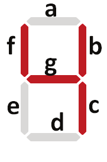
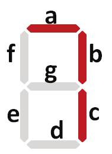

# Cronômetro Digital Usando Microcontrolador 8051

# Integrantes

- André Jacob Suaide - **13864673**
- Henrique de Oliveira Araújo - **13863950**
- Oliver Kenzo Kobayashi - **13676930**
- Vítor Augusto Paiva de Brito - **13732303**

Este repositório contém o projeto para o curso de **Microprocessadores e Sistemas Embarcados** (***SEL0614/SEL0433***), com foco no desenvolvimento de um cronômetro digital utilizando linguagem Assembly no simulador do microcontrolador **8051** (***EdSim51***).

## Visão Geral do Projeto

O objetivo deste projeto é implementar um cronômetro digital que:
- Exibe números de 0 a 9 em um display de 7 segmentos, em loop.
- Oferece dois intervalos de temporização controlados por interruptores:
  - **Intervalos de 0,25 segundos** usando o SW0.
  - **Intervalos de 1 segundo** usando o SW1.
- Permite alternar entre os modos de temporização ao pressionar os interruptores.
- Inicia a contagem apenas quando um interruptor é pressionado, mantendo o display desligado até então.

## Funcionalidades
- **Código em Assembly:** Escrito em Assembly para o microcontrolador 8051, utilizando o simulador EdSim51.
- **Controle por Interruptores:** Dois interruptores (SW0 e SW1) são utilizados para controlar os intervalos de contagem do cronômetro.
- **Controle de Temporização:** O programa altera o intervalo do display entre 0,25s e 1s, dependendo do interruptor pressionado.
- **Design Modular:** Utiliza sub-rotinas para lidar com o delay e a detecção de eventos dos interruptores.
- **Interface de I/O:** Interage com entradas externas (botões) e saídas (LEDs, display de 7 segmentos).

## Explicação do projeto

O cronômetro exibe números de 0 a 9 no display de 7 segmentos, controlando a temporização entre os números com dois botões: SW0 (0,25s) e SW1 (1s). A alternância entre os intervalos ocorre dinamicamente, e o display permanece desligado até o primeiro pressionamento. A lógica do projeto é implementada com sub-rotinas de delay e instruções condicionais para verificar os botões e controlar o tempo de exibição de cada número. O display utiliza a porta P1 do 8051 para exibir os números por meio de combinações de bits.


# Explicação do Código

## Definição de Registradores e Variáveis

O código começa com a definição de variáveis e registradores importantes para o funcionamento do programa:

- `TIME_REGISTER EQU R1`: Define o registrador R1 para a contagem de tempo.
- `SWITCH0 EQU P2.0`: Define o primeiro switch como P2.0.
- `SWITCH1 EQU P2.1`: Define o segundo switch como P2.1.
- `SEVEN_SEG_DISPLAY EQU P1`: Define o display de sete segmentos como P1.

## Início do Programa (Rotina `begin`)

A rotina `begin` inicializa o ponteiro `DPTR` com o endereço do conjunto de algarismos `ALGS`, que contém os valores que serão exibidos no display de sete segmentos.

```assembly
begin:
    MOV DPTR, #ALGS
```

## Loop Principal (Rotina `main`)

A rotina `main` é o loop principal do código. Ela verifica constantemente se algum dos switches foi pressionado. Se o `SWITCH0` ou o `SWITCH1` for pressionado, o código salta para a rotina de atualização (`update`), que atualiza o valor exibido no display. Se nenhum switch for pressionado, o loop continua executando indefinidamente.

```assembly
main: 
    JNB SWITCH0, update
    JNB SWITCH1, update
    SJMP main
```

## Atualização do Display (Rotina `update`)

A rotina `update` é responsável por atualizar o valor exibido no display de sete segmentos. Ela primeiro esvazia o acumulador (`A`) e, em seguida, carrega o próximo algarismo da tabela `ALGS` e o exibe no display. O ponteiro `DPTR` é incrementado para apontar para o próximo valor da tabela.

```assembly
update:
    CLR A
    MOVC A, @A+DPTR
    MOV SEVEN_SEG_DISPLAY, A
    INC DPTR
    JMP delay_choose
```

## Escolha do Atraso de Tempo (Rotina `delay_choose`)

Esta rotina verifica qual switch foi pressionado para determinar o tempo de atraso entre as atualizações do display. Se o `SWITCH0` for pressionado, o atraso será de 0,25 segundos. Se o `SWITCH1` for pressionado, o atraso será de 1 segundo. Caso nenhum dos switches esteja pressionado, o código retorna ao loop principal.

```assembly
delay_choose:
    JNB SWITCH0, sleep_025s
    JNB SWITCH1, sleep_1s
    JMP main
```

## Atraso de 1 Segundo (Rotina `sleep_1s`)

Esta rotina implementa um atraso de 1 segundo. Ela define 200 ciclos em `R0` e chama a sub-rotina `loop_1s` para criar o atraso de tempo. Se o valor no acumulador não for 9, o programa retorna à rotina de atualização (`update`), caso contrário, o ponteiro `DPTR` é reiniciado para começar a contagem do zero novamente.

```assembly
sleep_1s:
    MOV R0, #200
    ACALL loop_1s
    CJNE A, #090h, update
    ACALL reset_alg
    JMP main
```

## Loop para 1 Segundo (Rotina `loop_1s`)

A rotina `loop_1s` é responsável por criar o atraso de 1 segundo. Ela utiliza o registrador `TIME_REGISTER`, que é inicializado com 1000 (representando 1000 milissegundos). O valor é decrementado até que atinja zero, repetindo o processo para todos os ciclos de `R0`.

```assembly
loop_1s:
    MOV TIME_REGISTER, #1000
    DJNZ TIME_REGISTER, $
    DJNZ R0, loop_1s
    RET
```

## Atraso de 0,25 Segundo (Rotina `sleep_025s`)

Esta rotina é semelhante à rotina `sleep_1s`, mas implementa um atraso de 0,25 segundos. Ela define 100 ciclos em `R0` e chama a sub-rotina `loop_025s`. Se o valor no acumulador não for 9, o código retorna à rotina de atualização. Se o valor for 9, o ponteiro `DPTR` é reiniciado.

```assembly
sleep_025s:
    MOV R0, #100
    ACALL loop_025s
    CJNE A, #090h, update
    ACALL reset_alg
    JMP main
```

## Loop para 0,25 Segundo (Rotina `loop_025s`)

A rotina `loop_025s` implementa o atraso de 0,25 segundos. Ela inicializa o registrador `TIME_REGISTER` com 250 (representando 250 milissegundos). Assim como em `loop_1s`, o valor é decrementado até atingir zero, repetindo o processo para todos os ciclos de `R0`.

```assembly
loop_025s:
    MOV TIME_REGISTER, #250
    DJNZ TIME_REGISTER, $
    DJNZ R0, loop_025s
    RET
```

## Reinicialização do Ponteiro (Rotina `reset_alg`)

A rotina `reset_alg` reinicia o ponteiro `DPTR` para o início da tabela `ALGS`, permitindo que a contagem comece novamente a partir de 0.

```assembly
reset_alg:
    MOV DPTR, #ALGS
    RET
```

## Tabela de Algarismos (Tabela `ALGS`)

Esta tabela contém os valores em hexadecimal que correspondem aos números de 0 a 9, para serem exibidos no display de sete segmentos.

```assembly
ALGS:
    DB 0C0h, 0F9h, 0A4h, 0B0h, 099h, 092h, 082h, 0F8h, 080h, 090h
```


# Diagrama esquemático


# Tabela de varredura do display

| Valor decimal correspondente | Valor de endereçamento imediato | Valor hexadecimal | Resultado  |
|------------------------------|---------------------------------|--------------------|------------|
| 0                            | `#11000000b`                    | `0xC0`             |  |
| 1                            | `#11111001b`                    | `0xF9`             |  |
| 2                            | `#10100100b`                    | `0xA4`             |  |
| 3                            | `#10110000b`                    | `0xB0`             |  |
| 4                            | `#10011001b`                    | `0x99`             |  |
| 5                            | `#10010010b`                    | `0x92`             |  |
| 6                            | `#10000010b`                    | `0x82`             |  |
| 7                            | `#11111000b`                    | `0xF8`             |  |
| 8                            | `#10000000b`                    | `0x80`             |  |
| 9                            | `#10011000b`                    | `0x90`             |  |


## Como Executar
1. Carregue o código Assembly no simulador EdSim51.
2. Use os interruptores disponíveis para alternar entre os diferentes intervalos de tempo do cronômetro.
3. Observe o display de 7 segmentos para a contagem em loop.

## Arquivos Incluídos
- `chronometer.asm`: O código fonte Assembly para o microcontrolador 8051.
- Documentação incluindo:
  - Um diagrama esquemático do microcontrolador e suas conexões.
  - Uma tabela explicando como o display de 7 segmentos é controlado usando os registradores de porta.

## Diagrama
- Um diagrama esquemático do microcontrolador 8051 com suas interfaces de I/O e conexões com o display.

## Requisitos
- Simulador EdSim51.
