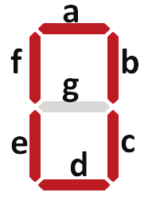
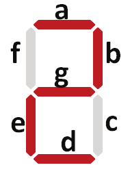
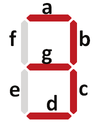

# Cronômetro Digital Usando Microcontrolador 8051

Este repositório contém o projeto para o curso de **Microprocessadores e Sistemas Embarcados** (***SEL0614/SEL0433***), com foco no desenvolvimento de um cronômetro digital utilizando linguagem Assembly no simulador do microcontrolador **8051** (***EdSim51***).

## Visão Geral do Projeto

O objetivo deste projeto é implementar um cronômetro digital que:
- Exibe números de 0 a 9 em um display de 7 segmentos, em loop.
- Oferece dois intervalos de temporização controlados por interruptores:
  - **Intervalos de 0,25 segundos** usando o SW0.
  - **Intervalos de 1 segundo** usando o SW1.
- Permite alternar entre os modos de temporização ao pressionar os interruptores.
- Inicia a contagem apenas quando um interruptor é pressionado, mantendo o display desligado até então.

## Funcionalidades
- **Código em Assembly:** Escrito em Assembly para o microcontrolador 8051, utilizando o simulador EdSim51.
- **Controle por Interruptores:** Dois interruptores (SW0 e SW1) são utilizados para controlar os intervalos de contagem do cronômetro.
- **Controle de Temporização:** O programa altera o intervalo do display entre 0,25s e 1s, dependendo do interruptor pressionado.
- **Design Modular:** Utiliza sub-rotinas para lidar com o delay e a detecção de eventos dos interruptores.
- **Interface de I/O:** Interage com entradas externas (botões) e saídas (LEDs, display de 7 segmentos).

## Explicação do projeto

O cronômetro exibe números de 0 a 9 no display de 7 segmentos, controlando a temporização entre os números com dois botões: SW0 (0,25s) e SW1 (1s). A alternância entre os intervalos ocorre dinamicamente, e o display permanece desligado até o primeiro pressionamento. A lógica do projeto é implementada com sub-rotinas de delay e instruções condicionais para verificar os botões e controlar o tempo de exibição de cada número. O display utiliza a porta P1 do 8051 para exibir os números por meio de combinações de bits.

# Explicação do Código

O programa define constantes para facilitar o controle de entradas e saídas, como os interruptores `SWITCH0` e `SWITCH1` e o display de 7 segmentos, utilizando o microcontrolador 8051. No início, o ponteiro de dados `DPTR` é inicializado com o conjunto de algarismos `ALGS`, que contém os números de 0 a 9 a serem exibidos no display. O programa entra em um loop principal que verifica continuamente se um dos interruptores foi pressionado para atualizar o display.

Quando um interruptor é pressionado, a sub-rotina `update` é chamada para limpar o acumulador e carregar o próximo valor a ser exibido no display. O período de exibição é controlado pelas sub-rotinas `sleep_1s` e `sleep_025s`, que determinam se o display deve contar com um intervalo de 1 segundo ou 0,25 segundos, dependendo de qual interruptor foi pressionado. O programa continua alternando entre essas temporizações e atualizando o display até que a contagem atinja 9, momento em que a contagem é reiniciada.

O ciclo se repete indefinidamente, permitindo que o cronômetro continue exibindo números no display. A implementação faz uso eficiente de sub-rotinas de temporização e manipulação de entradas e saídas para garantir que a contagem seja precisa e possa ser alternada entre dois modos de tempo.

# Diagrama esquemático

# Tabela de varredura do display

| Valor decimal correspondente | Valor de endereçamento imediato | Valor hexadecimal | Resultado  |
|------------------------------|---------------------------------|--------------------|------------|
| 0                            | `#11000000b`                    | `0xC0`             |  |
| 1                            | `#11111001b`                    | `0xF9`             |  |
| 2                            | `#10100100b`                    | `0xA4`             |  |
| 3                            | `#10110000b`                    | `0xB0`             |  |
| 4                            | `#10011001b`                    | `0x99`             |  |
| 5                            | `#10010010b`                    | `0x92`             |  |
| 6                            | `#10000010b`                    | `0x82`             |  |
| 7                            | `#11111000b`                    | `0xF8`             |  |
| 8                            | `#10000000b`                    | `0x80`             |  |
| 9                            | `#10011000b`                    | `0x90`             |  |

## Como Executar
1. Carregue o código Assembly no simulador EdSim51.
2. Use os interruptores disponíveis para alternar entre os diferentes intervalos de tempo do cronômetro.
3. Observe o display de 7 segmentos para a contagem em loop.

## Arquivos Incluídos
- `chronometer.asm`: O código fonte Assembly para o microcontrolador 8051.
- Documentação incluindo:
  - Um diagrama esquemático do microcontrolador e suas conexões.
  - Uma tabela explicando como o display de 7 segmentos é controlado usando os registradores de porta.

## Diagrama
- Um diagrama esquemático do microcontrolador 8051 com suas interfaces de I/O e conexões com o display.

## Requisitos
- Simulador EdSim51.

# Integrantes

- Vítor Augusto Paiva de Brito - **13732303**
